


Machine Learning Engineer working across <b>Earth Observation, geospatial AI, scientific computing and cloud-native ML systems</b>. 
I build both models and the infrastructure around them — from satellite imagery and computer vision to distributed workflows, Kubernetes and MLOps.

<code>Earth Observation</code> · <code>Computer Vision</code> · <code>Scientific ML</code> · <code>STAC</code> · <code>CWL</code> · <code>Kubernetes</code> · <code>Argo</code> · <code>Dask</code>


<table>
<tr>
<td width="50%"><a href="https://github.com/pmembari/GeoKit"></a></td>
<td width="50%"><a href="https://github.com/pmembari/circuits-component-detection-yolo"></a></td>
</tr>
<tr>
<td width="50%"><a href="https://github.com/pmembari/ML-Training-Jobs-Mlflow-MinIO-Kubernetes"></a></td>
<td width="50%"><a href="https://github.com/pmembari/sentinel2"></a></td>
</tr>
<tr>
<td width="50%"><a href="https://github.com/pmembari/calrissian"></a></td>
<td width="50%"><a href="https://github.com/pmembari/COVID-19-ETL-Pipeline"></a></td>
</tr>
<tr>
<td width="50%"><a href="https://github.com/pmembari/big-data-computing"></a></td>
<td width="50%"><a href="https://github.com/pmembari/argo-automation"></a></td>
</tr>
<tr>
<td width="50%"><a href="https://github.com/pmembari/argocd-app-config"></a></td>
<td width="50%"><a href="https://github.com/pmembari/NTA-LLM"></a></td>
</tr>
<tr>
<td width="50%"><a href="https://github.com/pmembari/ML-Language-Traslation"></a></td>
<td width="50%"><a href="https://github.com/pmembari/TextSummerizer-NLP"></a></td>
</tr>
<tr>
<td width="50%"><a href="https://github.com/pmembari/Stock-Sentiment-Analysis-NLP"></a></td>
<td width="50%"><a href="https://github.com/pmembari/nlp-spam-classifier"></a></td>
</tr>
<tr>
<td width="50%"><a href="https://github.com/pmembari/NLP-Big-Data-Book-Classification"></a></td>
<td width="50%"><a href="https://github.com/pmembari/Kidney-Tumor-Classification-with-mlflow"></a></td>
</tr>
<tr>
<td width="50%"><a href="https://github.com/pmembari/Sleep-stage-classification"></a></td>
<td width="50%"><a href="https://github.com/pmembari/Torch-practice"></a></td>
</tr>
<tr>
<td width="50%"><a href="https://github.com/pmembari/House-prices-in-Thehran"></a></td>
<td width="50%"><a href="https://github.com/pmembari/Taxi-Fare_Prediction"></a></td>
</tr>
<tr>
<td width="50%"><a href="https://github.com/pmembari/Plant-Watering"></a></td>
<td width="50%"><a href="https://github.com/pmembari/mouher-lab"></a></td>
</tr>
<tr>
<td width="50%"><a href="https://github.com/pmembari/DeepLearning-Sapienza"></a></td>
<td width="50%"><a href="https://github.com/iacopomasi/NLP"></a></td>
</tr>
<tr>
<td width="50%"><a href="https://github.com/pmembari/GEO-WKT"></a></td>
<td width="50%"><a href="https://github.com/pmembari/ogc-api-processes-with-zoo"></a></td>
</tr>
<tr>
<td width="50%"><a href="https://github.com/parham-membari-terradue/machine-learning-process"></a></td>
<td width="50%"><a href="https://github.com/pmembari/pde-code-server"></a></td>
</tr>
</table>


<code>Transformers</code> · <code>YOLO</code> · <code>ONNX</code> · <code>MLflow</code> · <code>Helm</code> · <code>Argo Workflows</code> · <code>ArgoCD</code> · <code>Dask</code> · <code>PySpark</code> · <code>Xarray</code> · <code>GDAL</code> · <code>STAC</code>



ML ENGINEER · GEO AI · SCIENTIFIC COMPUTING · MLOPS

