<p align="center">
  
</p>

<div align="center">

### Building intelligent systems for Earth Observation, scientific computing & scalable ML.

<a href="https://www.linkedin.com/in/p-mem/">
  
</a>
<a href="mailto:p.membari96@gmail.com">
  
</a>
<a href="https://github.com/pmembari?tab=repositories">
  
</a>

<br/>


</div>

---

## `01 // dossier`

I'm **Parham Membari**, a Machine Learning Engineer working across
**Earth Observation, geospatial AI, scientific computing, and cloud-native ML systems**.

My work covers both sides of machine learning systems: developing models for
scientific and geospatial applications, and engineering the infrastructure
needed to run them reproducibly at scale.

I work with satellite imagery, computer vision, scientific data pipelines,
distributed computing, Kubernetes, workflow orchestration, and MLOps.

```text
focus       → geospatial AI · machine learning · scientific computing
systems     → kubernetes · argo · mlflow · dask
geo         → earth observation · STAC · GDAL · xarray
building    → developer tools · ML workflows · reproducible applications
